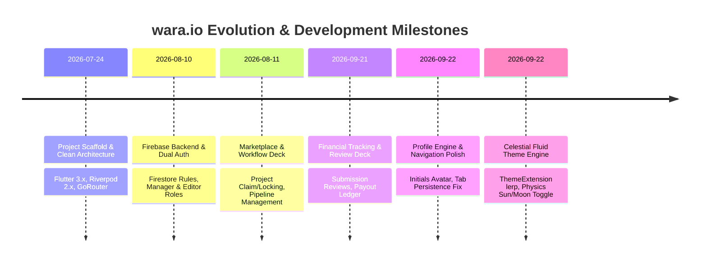

# 🚀 wara.io — Digital Footprint & Development Log

> This document serves as the official everyday progress journal and architectural chronicle for **wara.io (WARA Mobile App)**, tracking the technical evolution, design decisions, and milestones achieved throughout development.

---

## 📅 Chronological Milestone Log

---

### 🔹 Milestone 1: Architectural Foundation & Project Scaffolding
- **Objective:** Establish an enterprise-ready, scalable Flutter foundation with feature-first modular architecture.
- **Key Deliverables:**
  - Initialized Flutter mobile application with support for Android and iOS targets.
  - Adopted **Feature-First Clean Architecture** dividing the codebase into `core/`, `features/`, and `shared/`.
  - Configured **Flutter Riverpod 2.x** for declarative state management, reactive streaming, and dependency injection.
  - Setup **GoRouter** for declarative URL-driven routing, route guards, and shell navigation.
  - Defined initial typography, spacing tokens, and base theme palette.

---

### 🔹 Milestone 2: Cloud Firestore Backend & Role-Based Authentication
- **Objective:** Enable secure user authentication and synchronize data in real-time across devices.
- **Key Deliverables:**
  - Integrated **Firebase Core** and **Cloud Firestore** with native Android and iOS configurations.
  - Formulated secure `firestore.rules` separating access permissions between **Managers** and **Editors**.
  - Built `AuthProvider` managing session state, credentials, and user role identification.
  - Designed the unified **Authentication Portal** with custom animated forms and role-based redirect guards.
  - Created Firestore user synchronization ensuring profiles, roles, and timestamps stay updated.

---

### 🔹 Milestone 3: Editor Marketplace & Real-Time Locking Engine
- **Objective:** Eliminate video project contention and provide editors with an intuitive self-serve job pool.
- **Key Deliverables:**
  - **Available Project Pool:** Stream of open video editing offers with real-time status indicators.
  - **Atomic Project Locking:** Guaranteed single-editor claim mechanism to prevent race conditions when multiple editors attempt to accept the same video project simultaneously.
  - **Project Metadata:** Payout counters (\$), real-time deadline countdowns, client niche tags, and asset cloud links.
  - **Active Editor Workspace:** Dedicated workspace view tracking claimed projects through in-progress editing, rendering, and submission states.
  - **Delivery Pipeline:** Integrated submission modal allowing editors to submit deliverables and cloud drive links directly to agency managers.

---

### 🔹 Milestone 4: Manager Agency OS & Financial Dashboard
- **Objective:** Empower creative directors and agency leads to manage high-volume video pipelines effortlessly.
- **Key Deliverables:**
  - **Global Agency Workflow Deck:** High-altitude visual kanban of all agency projects categorized by state (*Available*, *Claimed*, *In Review*, *Revision*, *Completed*).
  - **One-Click Project Dispatch:** Streamlined modal for managers to draft new video projects, set deadlines, attach reference links, and broadcast to the editor pool.
  - **Pending Submission Review Queue:** Review deck displaying editor submissions with side-by-side notes, asset links, and one-tap **Approve** or **Request Revision** actions.
  - **Financial Metrics & Ledger:** Agency financial oversight tab displaying gross revenue, pending editor payouts, completed earnings, and profit margins.

---

### 🔹 Milestone 5: Identity System & Router State Preservation
- **Objective:** Polish user identity, customize profile management, and resolve tab state navigation glitches.
- **Key Deliverables:**
  - **Navigation Tab Bug Fix:** Resolved a critical bug where updating profile information caused GoRouter to reset the active tab back to the initial "Available Pool". Migrated to state-preserving shell navigation.
  - **Unified "Profile" Space:** Rebranded the settings tab to **Profile**, bringing profile details, software proficiencies, bandwidth, and app settings into a unified screen.
  - **Smart Avatar Engine (`WaraAvatar`):**
    - Built a robust, app-wide avatar widget supporting network images with smooth fallback.
    - Implemented smart initials algorithm: extracts the first letter of the **Surname** followed by the first letter of the **First Name** (e.g., *Ishraq Rafi* $\rightarrow$ **RI**).
  - **Profile Editing Modal:** Interactive bottom sheet allowing editors and managers to update their display names and photo URLs in real-time with instant Firestore persistence.

---

### 🔹 Milestone 6: Celestial Theme Engine & Fluid Physics Toggle
- **Objective:** Deliver a visually stunning, high-contrast Dark/Light theme mode with organic, physics-based transitions.
- **Key Deliverables:**
  - **Dynamic Theme Extension (`AppColors`):**
    - Extended Flutter's `ThemeExtension<AppColors>` to enable full frame-by-frame color interpolation via `lerp()`.
    - Defined dual high-contrast palettes: **Midnight Slate** (`#0B0E14`) and **Pure Daylight** (`#F8FAFC`).
  - **Zero-Flash Transition (`AnimatedTheme`):**
    - Wrapped the application root in `AnimatedTheme` with a 400ms cubic bezier curve, ensuring background, surface, text, and card tones glide smoothly without abrupt flashes.
  - **Physics-Based Toggle Switch (`WaraThemeToggle`):**
    - **Liquid / Squish Physics:** Dynamic horizontal pill expansion (`math.sin(t * math.pi) * 8px`) that stretches the thumb from 30px to 38px during transit and snaps cleanly into a circle on arrival.
    - **Celestial Icon Dynamics:**
      - **Sun:** 180° rotation (`t * math.pi`), scale boost to `1.08x`, warm amber aura glow (`#F59E0B`).
      - **Moon:** -45° orbital tilt, scale boost to `1.08x`, luminescent silver-indigo aura (`#818CF8`).
    - **Atmospheric Details:** Twinkling night stars with staggered opacities and subtle daytime morning gradient.
  - **Universal Dark Logo Badge (`WaraLogo`):**
    - Engineered `WaraLogo` to enforce the iconic dark/black (`#141414`) background badge with crisp border and subtle elevation across both light and dark themes.
    - Eliminates washout of the white eye line-art emblem when viewing the app in high-brightness Sun (Light) mode.
  - **Persistent Theme Preferences:** Backed by `SharedPreferences` to preserve the user's theme selection across app restarts.

---

## 🛠️ Technical Problem Solving Highlights

| Problem Encountered | Root Cause | Engineering Solution |
| :--- | :--- | :--- |
| Tab reset on profile update | Provider re-evaluation caused navigation rebuild to index 0 | Preserved shell navigation state and decoupled tab index from profile stream triggers. |
| Abrupt screen flashing on theme change | Hardcoded color swaps without interpolation | Implemented Flutter `ThemeExtension<AppColors>` with custom `lerp()` and root `AnimatedTheme`. |
| WARA eye logo invisible in light mode | White line art logo blended into dynamic white surface container | Created universal `WaraLogo` badge preserving iconic dark background and subtle drop shadow in both themes. |
| Race conditions on video claiming | Concurrent editor taps on the same post | Atomically locked project records in Firestore using transaction rules. |
| Inflexible avatar rendering | Hardcoded asset paths scattered across screens | Created universal `WaraAvatar` with network caching, error boundaries, and smart initials generation. |

---

## 📈 Future Milestones & Roadmap
- [ ] Push Notifications for new video offers via Firebase Cloud Messaging (FCM).
- [ ] In-app video preview player with timecode-accurate feedback markers.
- [ ] Automated PDF invoice generation for agency clients and editor payout stubs.
- [ ] Offline caching support for workspace reviews and project briefs.
